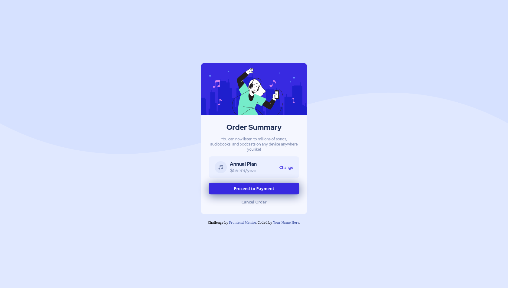

# Frontend Mentor - Order summary card solution

This is a solution to the [Order summary card challenge on Frontend Mentor](https://www.frontendmentor.io/challenges/order-summary-component-QlPmajDUj). Frontend Mentor challenges help you improve your coding skills by building realistic projects. 

## Table of contents

- [The challenge](#the-challenge)
- [Screenshot](#screenshot)
- [Links](#links)
- [Built with](#built-with)
- [Author](#author)

## The challenge

Users should be able to:

- See hover states for interactive elements

## Screenshot

## Links

- Solution URL: [Source Code](https://github.com/benHaseep/order-summary-component)
- Live Site URL: [Live Preview](https://benHaseep.github.io/order-summary-component)

## Built with

- Semantic HTML5 markup
- CSS custom properties
- Flexbox

## Author

- Website - [benHaseep.github.io](https://benHaseep.github.io)
- Frontend Mentor - [@benHaseep](https://www.frontendmentor.io/profile/benHaseep)
- Twitter - [@benHaseep](https://www.twitter.com/benHaseep)

